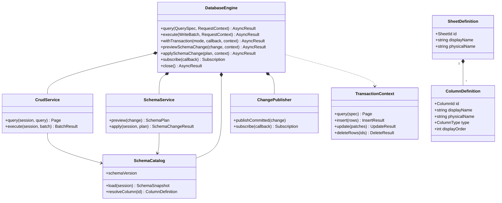
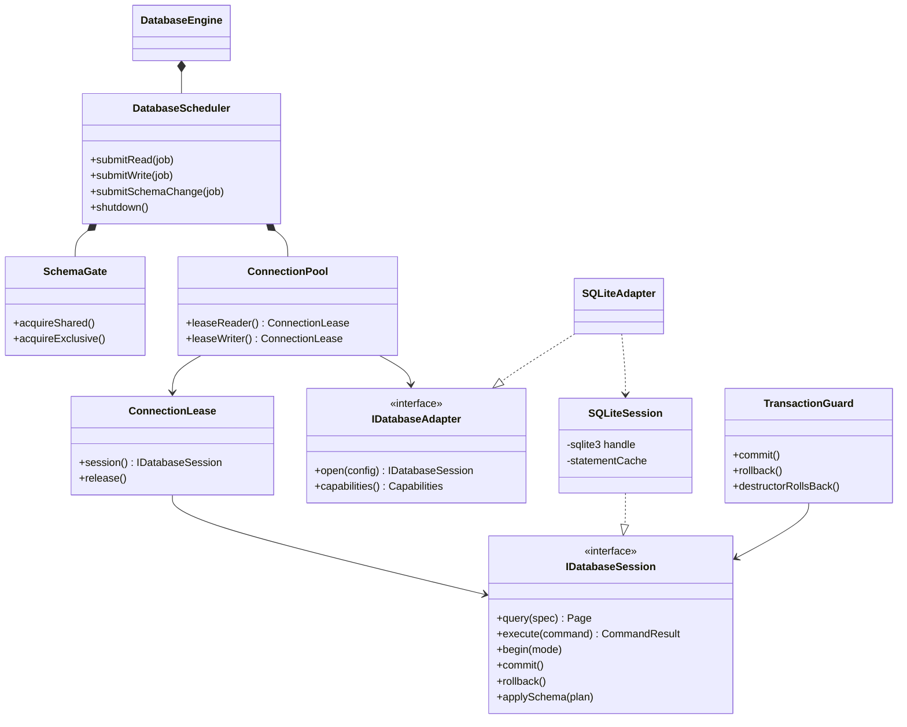

# C++ database layer for a spreadsheet application

## 1. Architecture and scope

Build a C++20 library around SQLite, with an asynchronous public interface and database-specific behavior behind an adapter.

For version one:

- One workbook maps to one local SQLite file; each sheet maps to a physical SQL table.
- Support row CRUD, filtering, sorting, pagination, atomic batches, and scoped transactions.
- Support adding, renaming, deleting, and changing the types of columns.
- Use app-owned databases and last-write-wins cell updates.
- Reserve an adapter boundary for a later shared application server.

**Concurrency model:** one writer connection plus a bounded reader pool per workbook. SQLite WAL allows readers alongside a writer, but still permits only one writer at a time. More writer connections would add contention rather than write parallelism. [SQLite WAL documentation](https://www.sqlite.org/wal.html)

Shared deployment is a later milestone: clients will call a server that owns database access. Do not share a SQLite WAL file over a network filesystem. [SQLite deployment constraints](https://www.sqlite.org/wal.html)

## 2. Class diagrams and public interfaces

### Services and domain model

### Execution and storage

**Public contracts**

- `AsyncResult<T>`: `std::future<Result<T, DbError>>`. Execute blocking SQLite calls on owned workers; provide a completion-dispatch bridge so the UI never waits on a future.
- `RequestContext`: cancellation token, deadline, and request ID.
- `QuerySpec`: sheet ID, selected column IDs, typed filters, sort order, and bounded pagination. Append row ID as a deterministic sort tie-breaker.
- `WriteBatch`: ordered inserts, cell patches, and deletes committed atomically.
- `CellPatch`: row ID plus only the changed column/value pairs.
- `SchemaPlan`: expected schema version, requested change, affected objects, and whether a table rebuild is required.
- `DbError`: typed codes including validation, missing row/column, stale schema, constraint violation, busy, cancelled, storage failure, and closed.

Keep SQL strings and SQLite handles private. Bind values and generate quoted identifiers from trusted catalog entries.

## 3. Behavior and implementation rules

### Storage and spreadsheet semantics

Each sheet table contains an immutable integer primary key. Internal metadata tables hold stable sheet/column IDs, display labels, column order, logical types, and a workbook schema version.

Use generated physical names derived from IDs. Adding a column performs SQL DDL; changing its display label or position updates metadata. Renames therefore preserve references without requiring physical SQL renames.

Initial types: nullable text, signed 64-bit integer, finite double, Boolean, and UTC timestamp stored as integer microseconds. Validate values in the library and enforce compatible SQL constraints. Empty text and `NULL` remain distinct.

Updates modify only supplied cells. For the same cell, the later successful write wins; different-cell changes both survive. Updating a deleted row returns `NotFound` and never recreates it.

### Async operations, pooling, and transactions

- Start with two reader workers/connections and one writer worker/connection per workbook. Make reader count configurable.
- Use bounded queues: default 256 pending jobs; return `Overloaded` when full.
- Lease each connection exclusively for the entire operation or transaction. Never share a live statement between jobs. SQLite explicitly restricts concurrent connection use in multithread mode. [SQLite threading documentation](https://www.sqlite.org/threadsafe.html)
- Enable WAL, foreign-key enforcement, and `synchronous=FULL`. Use a deadline-aware busy handler.
- Execute writes and read-write callbacks on the writer lane with `BEGIN IMMEDIATE`. Read-only callbacks use one reader connection and one snapshot.
- Transaction callbacks execute synchronously on the database worker using `TransactionContext`; prohibit network waits, UI interaction, nested engine calls, and escaping the context.
- Commit on callback success; rollback on errors, exceptions, or cancellation before commit. Never automatically replay a callback.
- Use RAII for connections, statements, and rollback. Return a connection to the pool only after statements and transaction state are reset.
- Cancellation is cooperative. If commit has succeeded, report success even if cancellation arrives afterward.
- Shutdown rejects new work, cancels queued work, and drains active operations before closing handles.

### Schema changes

Use a writer-preferred schema gate. Ordinary operations hold shared access for their duration; schema changes stop new admission and wait for active operations to finish. Acquire the gate before leasing a connection.

All physical changes, metadata changes, and the schema-version increment belong to one transaction:

- **Add:** create a nullable physical column; existing rows receive `NULL`.
- **Rename/reorder:** update display metadata.
- **Delete:** reject deletion of the internal row key; remove affected app-owned indexes and rebuild the table without the column.
- **Change type:** create a replacement table, validate and convert every value, copy rows preserving IDs, replace the original, and recreate valid indexes. Follow SQLite’s documented rebuild procedure. [SQLite schema changes](https://www.sqlite.org/lang_altertable.html)

Conversions preserve `NULL`, use locale-independent parsing, and reject invalid, overflowing, or lossy conversions. Never silently replace failed conversions with `NULL`. A single failure rolls back the entire change.

Preview reports destructive effects and estimated work; apply revalidates data under the exclusive gate. Reject stale schema plans. For ordinary queued requests, resolve stable column IDs and validate types again when execution begins.

After commit, invalidate cached schema/statements before reopening admission, then dispatch change notifications outside locks. Failed transactions emit no change event.

### Future shared backend

Retain typed commands and capability reporting across adapters. A later server can host this library or a PostgreSQL adapter; desktop clients will use a separate remote gateway.

Authentication, transport, request deduplication, cross-client notifications, and server transaction sessions belong to that later milestone. SQLite-first does not include offline synchronization or remote collaboration.

## 4. Task breakdown and acceptance tests

| Order | Task | Completion criteria |
|---|---|---|
| 1 | Establish C++20 library, CMake build, SQLite dependency, and domain contracts | Library builds; typed values, results, IDs, and errors are tested. |
| 2 | Implement SQLite RAII wrappers and workbook initialization | Open, close, reopen, metadata initialization, and invalid-file handling work without leaks. |
| 3 | Implement scheduler, bounded pool, and cancellation | Reads run concurrently; writes serialize; saturation and shutdown behave predictably. |
| 4 | Implement catalog and CRUD | Insert/read/patch/delete round-trip all types; filters and pagination work; SQL-like cell contents remain data. |
| 5 | Implement batches and transaction callbacks | Multi-cell paste is atomic; callback failure rolls back; read-only sessions reject writes. |
| 6 | Implement schema gate, add, rename, and reorder | Existing values survive; queued operations revalidate; metadata and DDL cannot diverge. |
| 7 | Implement delete and type-change rebuilds | Row IDs and unaffected values survive; bad conversion or disk failure restores the original table. |
| 8 | Implement commit notifications and UI completion bridge | UI callbacks run on the configured dispatcher; no callback runs under database locks. |
| 9 | Add durability tests, metrics, and performance benchmarks | Crash recovery, contention, bounded memory, and migration behavior are measured and documented. |

Required integration scenarios:

- Two writes to one cell: later successful write wins; writes to different cells both persist.
- Long reader plus writer: reader sees a consistent snapshot while the write commits.
- Cancellation while queued, during execution, and around commit produces correct outcomes.
- A schema change waits for an active transaction; later jobs see the new schema.
- Failed conversion, constraint violation, and interrupted migration leave no partial schema.
- External lock contention ends within the request deadline without replaying mutations.
- Process termination before and after commit preserves transaction atomicity.
- Benchmark 100,000 rows, paged scrolling, a 10,000-cell paste, and a full-column conversion; record latency, queue wait, WAL size, and peak memory before setting performance targets.

## 5. Assumptions and defaults

- One process owns each app-managed workbook during normal operation.
- Default request deadline: five seconds; schema changes: five minutes, both overridable.
- Schema rebuilds temporarily pause workbook operations and require additional disk space.
- Formulas, arbitrary SQL, custom triggers, inter-sheet foreign keys, undo history, and editing externally managed databases are outside version one.
- Pool sizes and queue limits are starting defaults to tune using the benchmark results.
